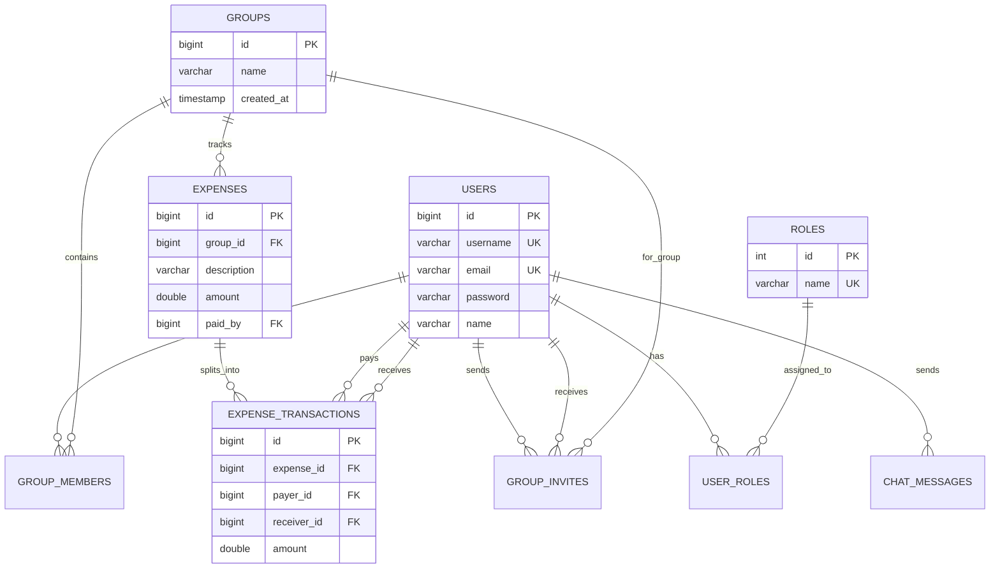

<div align="center">

# SplitUp — Expense Manager

**A full-stack group expense management & real-time chat application**

[](https://spring.io/projects/spring-boot)
[](https://reactnative.dev/)
[](https://expo.dev/)
[](https://www.postgresql.org/)
[](https://www.typescriptlang.org/)
[](https://openjdk.org/)
[](https://www.docker.com/)

[](https://render.com/)
[](https://neon.tech/)
[](https://vercel.com/)
[](https://uptimerobot.com/)

[Features](#features) · [Tech Stack](#tech-stack) · [Architecture](#architecture) · [Getting Started](#getting-started) · [API Reference](#api-reference) · [Deployment](#deployment)

---

### Try It Now

| **Install the APK** | **Web Demo** |
|:-:|:-:|
| [](https://expo.dev/accounts/dhaanishnihaal/projects/expense-manager-mobile/builds/5894077d-858b-4cef-80b1-c47aec7b493f) | https://expense-manager-coral-zeta.vercel.app |
| Originally designed as a **native mobile app** | Sample web preview via Expo Web export |

</div>

---

## Overview

**SplitUp** is a mobile-first expense splitting application — think *Splitwise meets WhatsApp*. Users can create groups, track shared expenses, automatically compute who owes whom via a greedy settlement algorithm, and communicate through real-time WebSocket-powered chat with typing indicators and online presence.

> Built with a **Spring Boot** REST API backend and a **React Native (Expo)** cross-platform mobile frontend.

---

## Features

| Category | Feature | Description |
|----------|---------|-------------|
| **Auth** | JWT Authentication | Stateless token-based auth with access & refresh tokens |
| **Auth** | Role-Based Access | `USER`, `MODERATOR`, `ADMIN` roles with fine-grained permissions |
| **Auth** | BCrypt Encryption | Industry-standard password hashing |
| **Groups** | Create & Manage Groups | Create groups, add/remove members, promote/demote admins |
| **Groups** | Invite System | Send, accept, or reject group invitations |
| **Expenses** | Expense Tracking | Log shared expenses within groups with payer and split details |
| **Expenses** | Transaction Ledger | Full history of who paid what and to whom |
| **Settlements** | Smart Settlement Engine | Greedy algorithm minimises the number of payments needed to settle up |
| **Settlements** | Quick Pay | Record cash / bank payments directly from the settlements screen |
| **Chat** | Real-Time Messaging | WebSocket (STOMP + SockJS) powered instant messaging |
| **Chat** | Typing Indicators | Animated typing dots show when the other user is composing |
| **Chat** | Online Presence | Live online/offline status badges on chat avatars |
| **Chat** | Unread Counts | Per-conversation unread message badges |
| **UX** | Pull-to-Refresh | Swipe down to refresh on every list screen |
| **UX** | Tab Navigation | Bottom tab bar for Groups, Settlements, Messages, Invitations |

---

## Tech Stack

### Backend

| Technology | Version | Purpose |
|------------|---------|---------|
| **[Spring Boot](https://spring.io/projects/spring-boot)** | 3.1.0 | Core REST API framework — auto-configuration, embedded Tomcat, and production-ready defaults make it the industry standard for Java microservices. |
| **[Spring Security](https://spring.io/projects/spring-security)** | 6.x | Handles authentication & authorisation. Configured with a custom JWT filter chain that intercepts every request, validates the bearer token, and sets the security context. |
| **[Spring Data JPA](https://spring.io/projects/spring-data-jpa)** | — | ORM layer that maps Java entities (User, Group, Expense, etc.) to relational tables. Provides repository interfaces so CRUD operations require zero boilerplate SQL. |
| **[Spring WebSocket](https://docs.spring.io/spring-framework/reference/web/websocket.html)** | — | Enables real-time bidirectional communication. Uses the STOMP sub-protocol over SockJS for chat messaging, typing indicators, and online presence broadcasts. |
| **[JJWT (io.jsonwebtoken)](https://github.com/jwtk/jjwt)** | 0.11.5 | Library for creating and parsing JSON Web Tokens. Used to issue signed access tokens on login and verify them on every protected endpoint. |
| **[PostgreSQL](https://www.postgresql.org/)** | 15+ | Production relational database. Stores users, groups, expenses, transactions, chat messages, and invitations with full referential integrity. |
| **[Lombok](https://projectlombok.org/)** | — | Annotation processor that generates getters, setters, constructors, and builder patterns at compile time — reduces entity class boilerplate by ~60%. |
| **[Maven](https://maven.apache.org/)** | 3.6+ | Build automation & dependency management. The included `mvnw` wrapper ensures reproducible builds without requiring a local Maven installation. |
| **[Docker](https://www.docker.com/)** | — | Containerisation via a multi-step Dockerfile (`eclipse-temurin:17-jdk-alpine` base). Enables one-command deployment to Render, Railway, or any container host. |

### Frontend

| Technology | Version | Purpose |
|------------|---------|---------|
| **[React Native](https://reactnative.dev/)** | 0.81.5 | Cross-platform mobile framework. A single TypeScript codebase compiles to native iOS and Android apps, with optional web support. |
| **[Expo](https://expo.dev/)** | SDK 54 | Managed workflow toolkit that handles native builds, OTA updates (`expo-updates`), splash screens, and device APIs without touching Xcode or Android Studio. |
| **[Expo Router](https://docs.expo.dev/router/introduction/)** | 6.x | File-based routing — every file in `app/` becomes a screen. Supports nested layouts (`(tabs)`, `(auth)`), typed routes, and deep linking out of the box. |
| **[TypeScript](https://www.typescriptlang.org/)** | 5.9 | Strict type-checking across the entire frontend. Catches bugs at compile time, provides IntelliSense autocomplete, and documents interfaces for API responses. |
| **[React Navigation](https://reactnavigation.org/)** | 7.x | Powers the bottom tab navigator and stack screens. Used alongside Expo Router for fine-grained navigation control (modals, gestures, header customisation). |
| **[Axios](https://axios-http.com/)** | 1.13 | Promise-based HTTP client for all REST API calls. A central `api.ts` instance attaches the JWT bearer token to every outgoing request via interceptors. |
| **[@stomp/stompjs](https://stomp-js.github.io/)** | 7.3 | STOMP messaging client that connects to the backend's `/ws` WebSocket endpoint. Handles subscriptions for chat messages, typing events, and presence updates. |
| **[SockJS](https://github.com/nickg/sockjs-client)** | 1.6 | WebSocket fallback transport. If the device or network doesn't support native WebSockets, SockJS seamlessly falls back to HTTP long-polling. |
| **[AsyncStorage](https://react-native-async-storage.github.io/async-storage/)** | 2.2 | Persistent key-value store for the device. Caches the JWT token and user profile so users stay logged in across app restarts. |
| **[React Native Reanimated](https://docs.swmansion.com/react-native-reanimated/)** | 4.1 | High-performance animations running on the UI thread. Powers the typing-dots animation, screen transitions, and gesture-driven interactions. |
| **[EAS (Expo Application Services)](https://expo.dev/eas)** | — | Cloud build & submit pipeline. Configured for `development`, `preview` (APK), and `production` build profiles with auto-incrementing version numbers. |

---

## Architecture

```
┌────────────────────────────────────────────────────────────┐
│                    MOBILE CLIENT                           │
│          React Native · Expo · TypeScript                  │
│                                                            │
│  ┌──────────┐  ┌──────────┐  ┌──────────┐  ┌───────────┐  │
│  │  Groups   │  │ Expenses │  │Settlements│  │  Messages  │ │
│  └────┬─────┘  └────┬─────┘  └────┬──────┘  └─────┬─────┘ │
│       │              │             │               │       │
│       └──────────────┴─────────────┴───────┬───────┘       │
│                                            │               │
│                  Axios (REST)         STOMP/SockJS          │
└────────────────────┬───────────────────────┬───────────────┘
                     │                       │
                     ▼                       ▼
┌────────────────────────────────────────────────────────────┐
│                    SPRING BOOT API                         │
│                                                            │
│  ┌─────────────────────┐   ┌───────────────────────────┐   │
│  │   REST Controllers  │   │   WebSocket Broker        │   │
│  │  /api/auth/*        │   │   /ws (STOMP + SockJS)    │   │
│  │  /api/groups/*      │   │   /topic/messages         │   │
│  │  /api/expenses/*    │   │   /topic/typing           │   │
│  │  /api/settlements/* │   │   /topic/presence         │   │
│  │  /api/invites/*     │   └───────────────────────────┘   │
│  │  /api/chat/*        │                                   │
│  └────────┬────────────┘                                   │
│           │                                                │
│  ┌────────▼────────────┐   ┌───────────────────────────┐   │
│  │  Spring Security    │   │  Settlement Engine        │   │
│  │  JWT Filter Chain   │   │  (Greedy Algorithm)       │   │
│  └────────┬────────────┘   └───────────────────────────┘   │
│           │                                                │
│  ┌────────▼────────────┐                                   │
│  │  Spring Data JPA    │                                   │
│  │  Repositories       │                                   │
│  └────────┬────────────┘                                   │
└───────────┼────────────────────────────────────────────────┘
            │
            ▼
┌────────────────────┐
│    PostgreSQL      │
│  Users · Roles     │
│  Groups · Members  │
│  Expenses · Txns   │
│  Invites · Chats   │
└────────────────────┘
```

---

## Project Structure

```
Expense_manager/
├── backend/                          # Spring Boot REST API
│   ├── src/main/java/.../springjwt/
│   │   ├── controllers/              # Auth, Health, Test controllers
│   │   ├── models/                   # User, Role, ERole entities
│   │   ├── security/                 # JWT filter, WebSecurityConfig
│   │   ├── groups/                   # Group module
│   │   │   ├── expenses/             # Expense & Transaction CRUD
│   │   │   ├── balances/             # Settlement engine & balance API
│   │   │   ├── groupInvite/          # Invite send/accept/reject
│   │   │   └── dto/                  # Request/response DTOs
│   │   ├── chat/                     # Real-time chat module
│   │   │   ├── config/               # WebSocket & STOMP config
│   │   │   ├── controller/           # Chat message controller
│   │   │   ├── entity/               # ChatMessage, ChatRoom entities
│   │   │   ├── service/              # Chat business logic
│   │   │   └── repository/           # Chat data access
│   │   └── payload/                  # Auth request/response payloads
│   ├── Dockerfile                    # Container build instructions
│   ├── pom.xml                       # Maven dependencies
│   └── mvnw / mvnw.cmd              # Maven wrapper scripts
│
├── frontend/                         # React Native (Expo) mobile app
│   ├── app/                          # File-based routes (Expo Router)
│   │   ├── (auth)/                   # Login & Register screens
│   │   ├── (tabs)/                   # Bottom tab screens
│   │   │   ├── index.tsx             # Groups home screen
│   │   │   ├── settlements.tsx       # Settlement balances
│   │   │   ├── messages.tsx          # Chat list
│   │   │   └── invitations.tsx       # Pending invites
│   │   ├── chat/                     # Chat conversation screens
│   │   ├── groups/                   # Group detail screens
│   │   └── expenses/                 # Expense detail screens
│   ├── src/
│   │   ├── api/                      # Axios API service modules
│   │   ├── auth/                     # Auth guard & auth service
│   │   ├── contexts/                 # WebSocket & Message providers
│   │   ├── components/               # Reusable UI components
│   │   ├── hooks/                    # Custom React hooks
│   │   ├── types/                    # TypeScript type definitions
│   │   └── constants/                # App-wide constants
│   ├── app.json                      # Expo configuration
│   ├── eas.json                      # EAS Build profiles
│   ├── package.json                  # NPM dependencies
│   └── tsconfig.json                 # TypeScript configuration
│
├── setup_database.sql                # Database initialisation script
├── insert_roles.sql                  # Role seed data
└── README.md
```

---

## Getting Started

### Prerequisites

| Tool | Version | Installation |
|------|---------|-------------|
| Java JDK | 17+ | [Download](https://adoptium.net/) |
| Maven | 3.6+ | Included via `mvnw` wrapper |
| PostgreSQL | 15+ | [Download](https://www.postgresql.org/download/) |
| Node.js | 18+ | [Download](https://nodejs.org/) |
| Expo CLI | Latest | `npm install -g expo-cli` |

### 1. Clone the Repository

```bash
git clone https://github.com/DhaanishNihaal/Expense_manager.git
cd Expense_manager
```

### 2. Backend Setup

```bash
cd backend
```

**a) Create the database:**

```sql
CREATE DATABASE testdb_spring;
```

**b) Configure application properties:**

```bash
cp src/main/resources/application.properties.example src/main/resources/application.properties
```

Edit `application.properties` and set your credentials:

```properties
spring.datasource.url=jdbc:postgresql://localhost:5432/testdb_spring
spring.datasource.username=your_username
spring.datasource.password=your_password
bezkoder.app.jwtSecret=your_jwt_secret_key
```

**c) Build and run:**

```bash
./mvnw clean compile
./mvnw spring-boot:run
```

The API will be available at `http://localhost:8080`.

**d) Seed the roles** (first run only):

```sql
INSERT INTO roles(name) VALUES('ROLE_USER');
INSERT INTO roles(name) VALUES('ROLE_MODERATOR');
INSERT INTO roles(name) VALUES('ROLE_ADMIN');
```

### 3. Frontend Setup

```bash
cd frontend
npm install
```

**a) Configure the API URL:**

Edit `.env.development` to point at your backend:

```env
EXPO_PUBLIC_API_URL=http://localhost:8080
```

**b) Start the development server:**

```bash
npx expo start
```

Scan the QR code with **Expo Go** (iOS/Android) or press `a` for Android emulator / `i` for iOS simulator.

---

## API Reference

### Authentication

| Method | Endpoint | Description | Auth |
|--------|----------|-------------|------|
| `POST` | `/api/auth/signup` | Register a new user | No |
| `POST` | `/api/auth/signin` | Login and receive JWT | No |

### Groups

| Method | Endpoint | Description | Auth |
|--------|----------|-------------|------|
| `POST` | `/api/groups` | Create a new group | Yes |
| `GET` | `/api/groups` | List user's groups | Yes |
| `GET` | `/api/groups/{id}` | Get group details | Yes |
| `POST` | `/api/groups/{id}/members` | Add a member | Yes |
| `DELETE` | `/api/groups/{id}/leave` | Leave a group | Yes |
| `DELETE` | `/api/groups/{id}/remove/{memberId}` | Remove a member (admin) | Yes |
| `PUT` | `/api/groups/{id}/promote/{memberId}` | Promote to admin | Yes |
| `PUT` | `/api/groups/{id}/demote/{memberId}` | Demote to member | Yes |

### Expenses & Transactions

| Method | Endpoint | Description | Auth |
|--------|----------|-------------|------|
| `POST` | `/api/expenses` | Create an expense | Yes |
| `GET` | `/api/expenses/group/{groupId}` | List group expenses | Yes |
| `GET` | `/api/transactions/group/{groupId}` | List group transactions | Yes |

### Settlements & Balances

| Method | Endpoint | Description | Auth |
|--------|----------|-------------|------|
| `GET` | `/api/balances/group/{groupId}` | Get group balances | Yes |
| `GET` | `/api/settlements/me` | Get user's overall settlements | Yes |
| `POST` | `/api/settlements/pay` | Record a settlement payment | Yes |

### Group Invitations

| Method | Endpoint | Description | Auth |
|--------|----------|-------------|------|
| `POST` | `/api/invites/send` | Send a group invite | Yes |
| `GET` | `/api/invites/pending` | List pending invites | Yes |
| `POST` | `/api/invites/{id}/accept` | Accept an invite | Yes |
| `POST` | `/api/invites/{id}/reject` | Reject an invite | Yes |

### Chat

| Method | Endpoint | Description | Auth |
|--------|----------|-------------|------|
| `GET` | `/api/chat/my-chats` | List user's conversations | Yes |
| `GET` | `/api/chat/{chatId}/messages` | Get chat messages | Yes |
| `POST` | `/api/chat/send` | Send a message | Yes |

### WebSocket Endpoints

| Endpoint | Protocol | Purpose |
|----------|----------|---------|
| `/ws` | STOMP over WebSocket | Primary real-time connection |
| `/ws` | STOMP over SockJS | Fallback for restricted networks |
| `/topic/messages` | Subscribe | Receive new chat messages |
| `/topic/typing` | Subscribe | Receive typing indicator events |
| `/topic/presence` | Subscribe | Receive online/offline status updates |

### Health Check

| Method | Endpoint | Description | Auth |
|--------|----------|-------------|------|
| `GET` | `/api/health` | API health status | No |

---

## Deployment

SplitUp uses a fully cloud-hosted deployment pipeline. Every layer runs on a free/hobby tier — no credit card required.

### Deployment Architecture

```
┌─────────────┐     ┌──────────────┐     ┌──────────────┐
│  UptimeRobot │────▶│    Render     │────▶│     Neon     │
│  (Monitor)   │     │  Spring Boot  │     │  PostgreSQL  │
│  /api/health │     │  Docker+JDK17 │     │  Serverless  │
└─────────────┘     └──────────────┘     └──────────────┘
                           ▲
              ┌────────────┴────────────┐
              │                         │
     ┌────────┴────────┐      ┌─────────┴────────┐
     │   Expo / EAS    │      │     Vercel       │
     │  Android APK    │      │  Web Preview     │
     │  (Mobile App)   │      │  (dist/ export)  │
     └─────────────────┘      └──────────────────┘
```

| Layer | Service | Purpose |
|-------|---------|--------|
| **Backend API** | [Render](https://render.com/) | Hosts the Spring Boot Docker container |
| **Database** | [Neon](https://neon.tech/) | Serverless PostgreSQL with auto-scaling |
| **Mobile App** | [Expo EAS](https://expo.dev/eas) | Builds & distributes the Android APK |
| **Web Preview** | [Vercel](https://vercel.com/) | Hosts the Expo Web (`dist/`) static export |
| **Monitoring** | [UptimeRobot](https://uptimerobot.com/) | Pings `/api/health` to keep the server alive |

---

### Render — Backend API

The Spring Boot backend is containerised with Docker and deployed on **Render's** free web service tier.

| | |
|---|---|
| **Live URL** | `https://expense-manager-mjt5.onrender.com` |
| **Build** | Docker (`eclipse-temurin:17-jdk-alpine`) |
| **Health Check** | `GET /api/health` |

> **Note:** Render's free tier spins down after 15 minutes of inactivity. UptimeRobot prevents this (see below).

**Docker build (local):**

```bash
cd backend
docker build -t splitup-api .
docker run -p 8080:8080 \
  -e SPRING_DATASOURCE_URL=jdbc:postgresql://host:5432/testdb_spring \
  -e SPRING_DATASOURCE_USERNAME=user \
  -e SPRING_DATASOURCE_PASSWORD=pass \
  -e BEZKODER_APP_JWTSECRET=your_secret \
  splitup-api
```

---

### Neon — Serverless PostgreSQL

**[Neon](https://neon.tech/)** provides the production PostgreSQL database with a serverless, auto-scaling architecture.

| | |
|---|---|
| **Why Neon?** | Serverless cold-start in ~500ms, auto-suspend on idle, generous free tier (0.5 GB storage) |
| **Connection** | Standard `jdbc:postgresql://` connection string via Render environment variables |
| **Branching** | Neon supports database branching — useful for staging/preview environments |

The backend connects to Neon using the `SPRING_DATASOURCE_URL` environment variable set on Render. No special driver needed — it's standard PostgreSQL.

---

### Expo EAS — Mobile APK

The primary distribution channel. SplitUp is **originally designed as a native mobile application**.

| | |
|---|---|
| **Latest APK** | [Download from Expo](https://expo.dev/accounts/dhaanishnihaal/projects/expense-manager-mobile/builds/5894077d-858b-4cef-80b1-c47aec7b493f) |
| **Build System** | Expo Application Services (EAS Build) |
| **OTA Updates** | Enabled via `expo-updates` — push JS updates without rebuilding |

**Build profiles** (configured in `eas.json`):

```bash
cd frontend

# Development build (internal testing with dev client)
eas build --profile development --platform android

# Preview APK (shareable APK for testers)
eas build --profile preview --platform android

# Production build (Play Store ready, auto-increment version)
eas build --profile production --platform android
```

---

### Vercel — Web Preview

A **sample web demo** is deployed on **[Vercel](https://vercel.com/)** using the Expo Web static export (`dist/` directory).

| | |
|---|---|
| **Purpose** | Quick browser-based preview for recruiters/reviewers |
| **Build** | `npx expo export --platform web` → deploy `dist/` to Vercel |
| **Note** | This is a **web preview only** — the app is designed and optimised for mobile |

> **Note:** Some native-only features (haptics, native gestures) are gracefully degraded in the web version.

---

### UptimeRobot — Health Monitoring & Keep-Alive

**[UptimeRobot](https://uptimerobot.com/)** pings the backend's health endpoint at regular intervals to:

1. **Prevent cold starts** — Render's free tier sleeps after 15 min of inactivity. UptimeRobot sends periodic `GET /api/health` requests to keep the server warm.
2. **Monitor uptime** — Get notified via email/webhook if the backend goes down.
3. **Track response times** — Historical latency data for performance monitoring.

| | |
|---|---|
| **Monitored Endpoint** | `https://expense-manager-mjt5.onrender.com/api/health` |
| **Ping Interval** | Every 5 minutes |
| **Alert Channels** | Email notifications on downtime |

---

## Security

- **JWT stateless authentication** — no server-side sessions
- **BCrypt password hashing** — adaptive cost factor
- **Role-based access control** — endpoint-level authorisation
- **CORS configuration** — restricts origins in production
- **SQL injection protection** — parameterised queries via JPA
- **WebSocket auth** — STOMP headers carry user identity

### Production Checklist

- [ ] Rotate the JWT secret to a strong, random 256-bit key
- [ ] Store secrets in environment variables, not config files
- [ ] Enable HTTPS / TLS termination
- [ ] Restrict CORS to your production domain only
- [ ] Set up automated database backups
- [ ] Configure rate limiting on auth endpoints

---

## Database Schema



---

## Author

**Dhaanish Nihaal**

- GitHub: [@DhaanishNihaal](https://github.com/DhaanishNihaal)

---

## License

This project is for personal / educational use.

---

<div align="center">

**Star this repository if you found it useful!**

</div>
